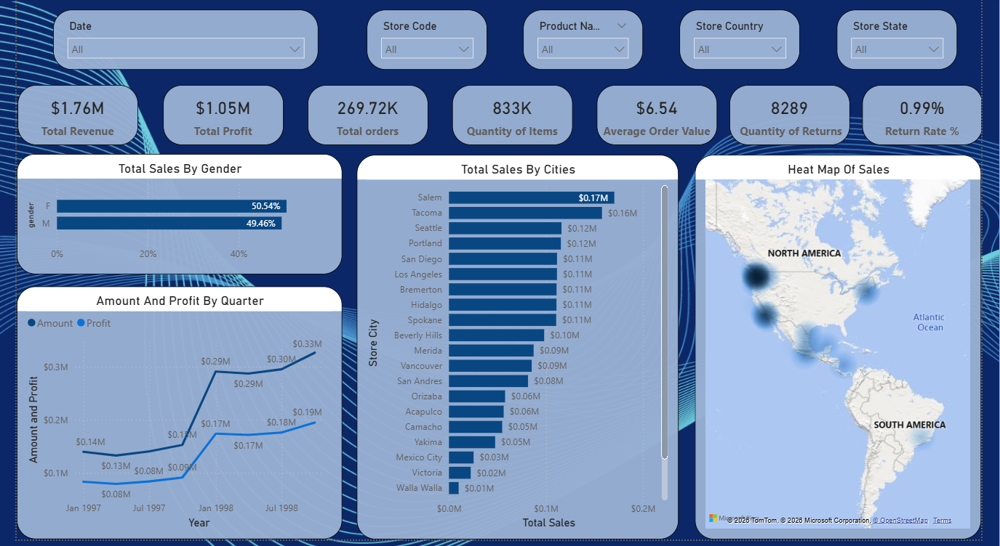
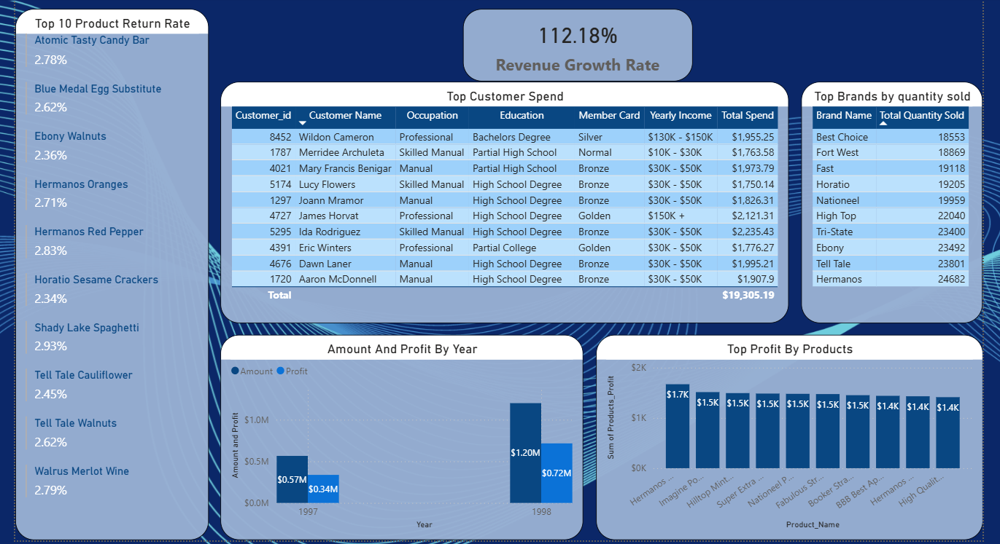
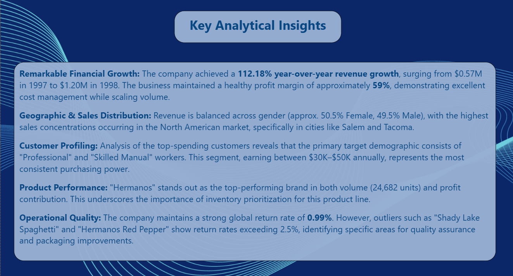

# 📊 Retail Sales & Customer Analytics (SQL & Power BI)

## 📌 Project Overview
This project is an end-to-end Data Analytics solution. It demonstrates the full data lifecycle: from raw data preparation and transformation using **SQL Server (T-SQL)**, to building an interactive, insightful Business Intelligence dashboard using **Power BI**. The project focuses on uncovering business trends, customer purchasing behavior, and operational efficiency over the 1997-1998 period.

---

## 🚀 Key Analytical Insights
* **Financial Growth:** Achieved a **112.18% year-over-year revenue growth**, surging from $0.57M to $1.20M.
* **Profitability:** Maintained a robust **59% profit margin**, showcasing efficient cost-to-revenue management.
* **Customer Behavior:** Identified "Professional" and "Skilled Manual" workers (earning $30K–$50K annually) as the primary drivers of revenue.
* **Operational Quality:** Pinpointed products with high return rates (>2.5%) for potential quality control and packaging improvements.

---

## 🛠️ Technical Stack & Workflow
The project was executed through a structured data pipeline:

### **1. Data Engineering (SQL)**
* **Cleaning & Transformation:** Used `Prepare.sql` to combine transactional tables, handle null values, and calculate key metrics (`Amount`, `Profit`).
* **Modeling:** Designed the database schema and created relationships using `Model.sql`.
* **Analytical Queries:** Developed complex `Views` and queries in `SQLQuery.sql` to extract KPIs, analyze growth rates, and profile customers.

### **2. Data Visualization (Power BI)**
* **Modeling:** Connected SQL Views to Power BI to ensure real-time data flow.
* **Interactive Dashboard:** Built a comprehensive dashboard featuring:
    * **Heat Maps:** For geographic sales distribution.
    * **Time-Series Analysis:** To track quarterly performance.
    * **Dynamic Slicers:** For filtering by region, product, and store.

---

## 📸 Dashboard Preview

| **Dashboard Overview** | **Customer Demographic & Behavioral Analysis** | **Key Analytical Insights** |
| :---: | :---: | :---: |
|  |  |  |

---

## 💡 Key Skills Showcase
* **Data Wrangling:** Expert use of SQL to clean and prepare complex datasets.
* **Business Intelligence:** Ability to translate business goals into measurable KPIs.
* **Data Storytelling:** Transforming complex data into easy-to-read, actionable visuals.

---

## 📬 Contact & Feedback
This project demonstrates end-to-end data analysis, from raw data preparation to actionable business insights.

**Developed by Gergess Magdy**
*Feel free to reach out for any questions regarding the data model or visualizations!*

*LinkedIn: [https://www.linkedin.com/in/gergess-magdy-b93790311ا]*
