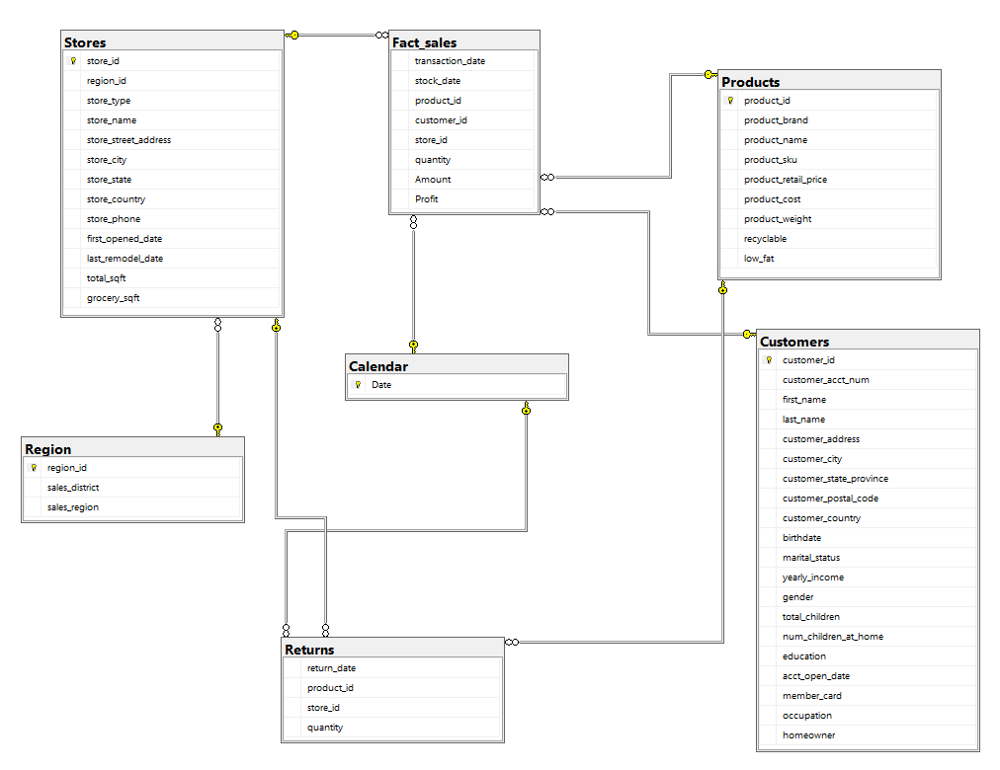

# 📊 Retail Sales & Customer Analytics (SQL & Power BI)

## 📌 Project Overview

This project analyzes retail sales data from **1997–1998** using **SQL Server (T-SQL)** and **Power BI** to uncover key business insights related to revenue growth, customer behavior, and product performance.

The project demonstrates the full **data analytics workflow**, including data preparation, transformation, analytical querying, and building an interactive Business Intelligence dashboard to support data-driven decision making.

---

# 🏗️ Project Architecture

The project follows a complete **data analytics pipeline** from raw data to interactive business intelligence dashboards.

Retail Excel Data  
↓  
SQL Server (Data Cleaning & Transformation)  
↓  
Star Schema Data Model  
↓  
SQL Analytical Queries & Views  
↓  
Power BI Dashboard  

This architecture ensures that the data flows through a structured process before being visualized for business insights.

---

# 📂 Dataset Structure

The dataset used in this project consists of multiple tables representing different aspects of the retail business, including customers, products, sales transactions, and returns.

| Table Name     | Description                                                                                                                  |
| -------------- | ---------------------------------------------------------------------------------------------------------------------------- |
| **Calendar**   | A date dimension table used for time-based analysis such as year, quarter, and month trends.                                 |
| **Customers**  | Contains customer demographic information including occupation, income level, and attributes used for customer segmentation. |
| **Products**   | Product catalog including product categories, subcategories, and pricing details.                                            |
| **Region**     | Geographic dimension used to analyze sales performance across different regions.                                             |
| **Returns**    | Records of returned products used to calculate return rates and analyze product quality.                                     |
| **Sales_1997** | Transactional sales data for the year **1997** used for sales performance analysis.                                          |
| **Sales_1998** | Transactional sales data for the year **1998** used for year-over-year comparison and growth analysis.                       |
| **Stores**     | Store information including store identifiers, store locations, and regional assignments.                                    |

These tables were integrated and transformed using **SQL Server (T-SQL)** to create a structured dataset for analytical reporting in Power BI.

---

# ❓ Business Questions

This analysis aims to answer several key business questions:

* How did revenue change between **1997 and 1998**?
* Which **customer segments** generate the highest revenue?
* Which **products have the highest return rates**?
* Which **regions and stores perform best**?
* What factors contribute most to **profitability**?

---

# 🚀 Key Analytical Insights

### 📈 Revenue Growth

Revenue increased by **112.18% year-over-year**, growing from **$0.57M to $1.20M**, indicating strong business growth.

### 💰 Profitability

The business maintained an average **59% profit margin**, demonstrating efficient cost management and pricing strategy.

### 👥 Customer Segments

Customers in the **"Professional"** and **"Skilled Manual"** occupations with annual incomes between **$30K–$50K** were identified as the primary revenue drivers.

### 📦 Product Quality

Products with **return rates above 2.5%** were identified, highlighting potential opportunities for **quality control and packaging improvements**.

---

# 🛠️ Technical Stack

### Data Processing

* SQL Server (T-SQL)
* Data Cleaning and Transformation
* Analytical SQL Queries
* SQL Views for Reporting

### Data Visualization

* Power BI
* Interactive Dashboard Design
* KPI Development
* Data Storytelling

---

# ⚙️ Data Workflow

The project follows a structured data analytics pipeline from raw data preparation to business intelligence visualization.

**1️⃣ Raw Data Sources**
Retail data was initially stored in multiple Excel tables including sales transactions, customer information, products, returns, and store data.

**2️⃣ Data Preparation (SQL Server)**
The raw tables were imported into SQL Server where the following steps were performed:

* Data cleaning and handling missing values
* Combining transactional tables
* Creating calculated fields such as **Amount** and **Profit**
* Standardizing column formats for analysis

**3️⃣ Data Modeling**

A relational data model was created connecting:

* Sales tables
* Customers
* Products
* Stores
* Calendar

This structure enabled efficient analytical queries.

**4️⃣ Analytical SQL Queries**

SQL queries and views were developed to calculate key metrics such as:

* Total Revenue
* Total Profit
* Return Rate
* Customer Segment Performance
* Year-over-Year Growth

**5️⃣ Power BI Data Model**

The SQL views were connected directly to Power BI to create a semantic data model for reporting.

**6️⃣ Dashboard Development**

An interactive Power BI dashboard was created to visualize business performance using:

* KPI cards
* Sales trend charts
* Geographic sales heat maps
* Customer demographic analysis
* Product return analysis

---

# 🗂️ Data Model

The database used in this project follows a **Star Schema** design, which is commonly used in **data warehousing and business intelligence systems**.

This structure separates the data into:

- **Fact Tables** → store transactional data
- **Dimension Tables** → store descriptive information used for filtering and analysis

The model enables efficient analysis across **customers, products, stores, regions, and time**.

---

# ⭐ Fact Tables

Fact tables contain measurable events such as sales and returns.

## Fact_sales

This is the main transactional table that records every product sale.

| Column | Description |
|------|-------------|
| transaction_date | Date when the sale occurred |
| stock_date | Date when the product was stocked |
| product_id | Identifier of the sold product |
| customer_id | Identifier of the customer |
| store_id | Identifier of the store |
| quantity | Number of units sold |

This table connects to several dimension tables such as **Products, Customers, Stores, and Calendar**.

---

## Returns

This table records product return transactions.

| Column | Description |
|------|-------------|
| return_date | Date when the product was returned |
| product_id | Returned product |
| store_id | Store where the return occurred |
| quantity | Number of returned units |

This table is used to analyze **product return rates and product quality issues**.

---

# 📊 Dimension Tables

Dimension tables store descriptive attributes used for slicing and filtering data.

---

## Customers

Contains demographic information about customers.

Important attributes include:

- customer_id (Primary Key)
- customer_acct_num
- first_name
- last_name
- customer_address
- customer_city
- customer_state_province
- customer_postal_code
- customer_country
- birthdate
- marital_status
- yearly_income
- gender
- total_children
- num_children_at_home
- education
- acct_open_date
- member_card
- occupation
- homeowner

This table allows analysis based on **customer demographics and socioeconomic attributes**.

---

## Products

Stores detailed information about each product.

Key attributes include:

- product_id (Primary Key)
- product_brand
- product_name
- product_sku
- product_retail_price
- product_cost
- product_weight
- recyclable
- low_fat

This table enables **product performance and profitability analysis**.

---

## Stores

Contains information about retail store locations.

Key attributes include:

- store_id (Primary Key)
- region_id
- store_type
- store_name
- store_street_address
- store_city
- store_state
- store_country
- store_phone
- first_opened_date
- last_remodel_date
- total_sqft
- grocery_sqft

This table allows analysis of **store performance and geographic distribution**.

---

## Region

Defines the geographical hierarchy of stores.

| Column | Description |
|------|-------------|
| region_id | Primary key of the region |
| sales_district | District name |
| sales_region | Regional sales group |

Stores are grouped into regions to analyze **regional sales performance**.

---

## Calendar

A date dimension used for time-based analysis.

| Column | Description |
|------|-------------|
| Date | Primary key representing a calendar date |

This table enables analysis by:

- Year
- Quarter
- Month
- Day

---

# 🔗 Relationships

The model uses **one-to-many relationships** between dimension tables and fact tables.

| Dimension Table | Fact Table | Join Key |
|----------------|------------|---------|
| Customers | Fact_sales | customer_id |
| Products | Fact_sales | product_id |
| Products | Returns | product_id |
| Stores | Fact_sales | store_id |
| Stores | Returns | store_id |
| Region | Stores | region_id |
| Calendar | Fact_sales | Date → transaction_date |
| Calendar | Returns | Date → return_date |

---

# 🧠 Schema Design Notes

- The data model mainly follows a **Star Schema architecture**.
- A small **Snowflake structure** exists where the **Region table connects to Stores** instead of connecting directly to fact tables.
- This design improves query performance and supports complex analytical queries.

Using this schema, analysts can measure:

- Total Sales
- Total Returns
- Profit Margin
- Sales by Region
- Customer Segment Performance
- Product Performance Over Time

This data model serves as the foundation for the **Power BI dashboard and business insights generated in this project**.

---

# 📊 Dashboard Features

The Power BI dashboard includes:

* Revenue & Profit KPIs
* Sales Trend Analysis
* Customer Demographic Insights
* Product Return Rate Analysis
* Regional Sales Performance
* Interactive Filters (Region, Product, Store)

---

# ▶️ How to Run the Project

Follow these steps to run the project locally:

1. Import the dataset tables into **SQL Server**.
2. Execute the SQL scripts located in the **SQL folder**.
3. Build the data model according to the provided schema.
4. Open the **Power BI (.pbix)** file located in the PowerBI folder.
5. Refresh the data connection to load the dataset.

Once the data is refreshed, the **Power BI dashboard will automatically populate all KPIs and visualizations.**

---

# 📁 Repository Structure

Retail-Sales-Analytics
│
├── SQL
│   ├── data_cleaning.sql
│   ├── data_model.sql
│   └── analytical_queries.sql
│
├── PowerBI
│   └── Retail_Dashboard.pbix
│
├── picture
│   ├── Diagram.png
│   ├── pic_1.png
│   ├── pic_2.png
│   └── pic_3.png
│
└── README.md

This structure keeps the project organized and makes it easier for analysts and developers to navigate the repository.

---

# 🖼 Dashboard Preview

<!-- Use HTML for bigger images on GitHub -->

  
   
  
  
  

---

# 📸 Dashboard Preview

|    **Dashboard Overview**    | **Customer Demographic & Behavioral Analysis** |  **Key Analytical Insights** |
| :--------------------------: | :--------------------------------------------: | :--------------------------: |
|  |                    |  |

---

# 💡 Skills Demonstrated

* SQL Data Cleaning & Transformation
* Data Modeling
* Business KPI Development
* Power BI Dashboard Development
* Customer Segmentation Analysis
* Data Visualization & Storytelling

---

# 🔮 Future Improvements

Possible future improvements for this project include:

- Adding **sales forecasting using predictive analytics**
- Building **Customer Lifetime Value (CLV) analysis**
- Integrating **real-time data pipelines**
- Expanding the dataset to include **multiple years of sales**
- Adding **advanced Power BI features such as drill-through and tooltips**

---

# 📬 Contact

**Developed by Gergess Magdy**

If you have any questions about the SQL queries, data model, or dashboard design, feel free to reach out.

🔗 LinkedIn
https://www.linkedin.com/in/gergess-magdy-b93790311
